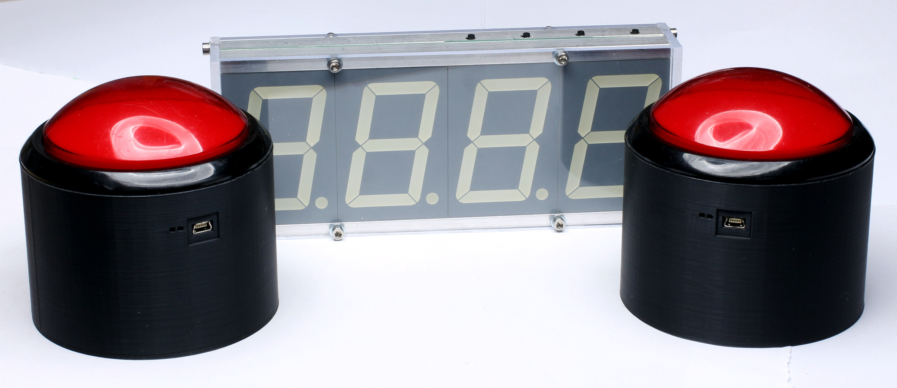

# What is it?
* A huge stopwatch with two big red control buttons (start and stop)
* Mainly intended for measuring time on an obstacle course

# How does it work?
* Each button and the display contain a radio module (RFM69)
* Button presses are send to the display which calculates the time

# Further features
* USB charging of the integrated LiPo batteries
* Retransmissions with time compensation if a radio packet gets lost
* Simple highscore management

